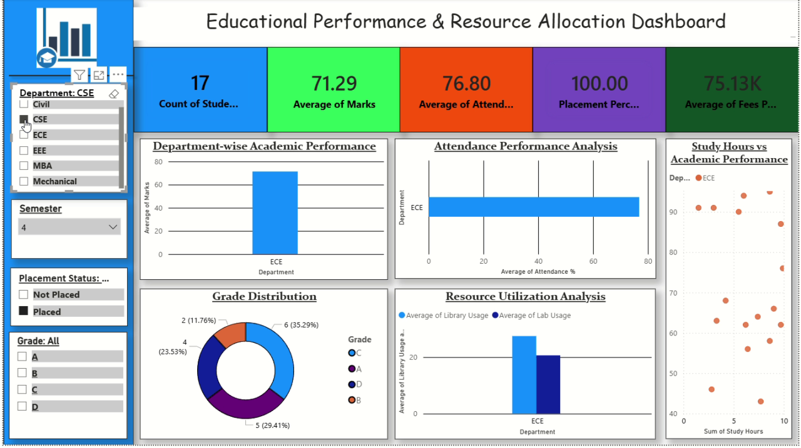

# Educational Performance & Resource Allocation Dashboard



Power BI dashboard for academic outcomes, attendance, placements, fees, and resource usage (library/lab) by department and cohort.

## Overview

| Item | Detail |
|------|--------|
| **Dashboard** | Educational Performance & Resource Allocation |
| **Task** | CodeAlpha Task 4 |
| **Screen recording** | [`../CodeAlphaTask-4.mp4`](../CodeAlphaTask-4.mp4) (~35 s) |
| **Thumbnail** | [`thumbnail.png`](./thumbnail.png) |

## Key metrics (KPI cards)

| Metric | Sample value |
|--------|----------------|
| Count of Students | 17 |
| Average of Marks | 71.29 |
| Average of Attendance % | 76.80 |
| Placement Percentage | 100.00 |
| Average of Fees Paid | 75.13K |

## Filters (left sidebar)

- **Department** — Civil, CSE, ECE, EEE, MBA, Mechanical
- **Semester** — Dropdown (e.g. 4)
- **Placement Status** — Placed, Not Placed
- **Grade** — A, B, C, D

## Visualizations

| Chart | Purpose |
|-------|---------|
| Department-wise Academic Performance | Bar chart of average marks by department |
| Attendance Performance Analysis | Horizontal bar chart of attendance % |
| Study Hours vs Academic Performance | Scatter plot (study hours vs performance) |
| Grade Distribution | Donut chart of grade counts and percentages |
| Resource Utilization Analysis | Clustered bars for library vs lab usage |

## Design notes

- Multi-color KPI cards (blue, green, orange, purple)
- Blue filter sidebar with education-themed branding
- Card-style visuals with light borders and shadows

## Files in this folder

```
CodeAlphaTask-4/
├── README.md
└── thumbnail.png
```
