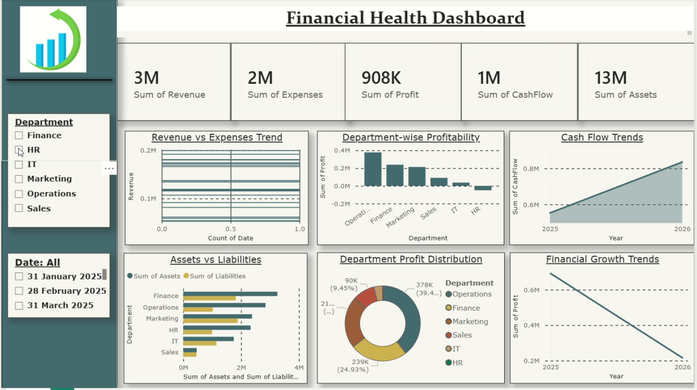

# Financial Health Dashboard



Power BI dashboard that summarizes company financial performance across departments and time periods.

## Overview

| Item | Detail |
|------|--------|
| **Dashboard** | Financial Health Dashboard |
| **Task** | CodeAlpha Task 1 |
| **Screen recording** | [`../codeAlphaTask-1.mp4`](../codeAlphaTask-1.mp4) (~34 s) |
| **Thumbnail** | [`thumbnail.png`](./thumbnail.png) |

## Key metrics (KPI cards)

| Metric | Sample value |
|--------|----------------|
| Sum of Revenue | 3M |
| Sum of Expenses | 2M |
| Sum of Profit | 908K |
| Sum of CashFlow | 1M |
| Sum of Assets | 13M |

## Filters (left panel)

- **Department** — Finance, HR, IT, Marketing, Operations, Sales
- **Date** — e.g. 31 Jan 2025, 28 Feb 2025, 31 Mar 2025

## Visualizations

| Chart | Purpose |
|-------|---------|
| Revenue vs Expenses Trend | Line chart of revenue over time |
| Department-wise Profitability | Bar chart of profit by department |
| Cash Flow Trends | Area chart of cash flow (2025–2026) |
| Assets vs Liabilities | Grouped horizontal bars by department |
| Department Profit Distribution | Donut chart of profit share (e.g. Operations ~39%) |
| Financial Growth Trends | Line chart of profit trend over time |

## Design notes

- Teal and gold theme on a light background
- Sidebar slicers for department and date
- Suited for executive and finance reporting

## Files in this folder

```
codeAlphaTask-1/
├── README.md
└── thumbnail.png
```
