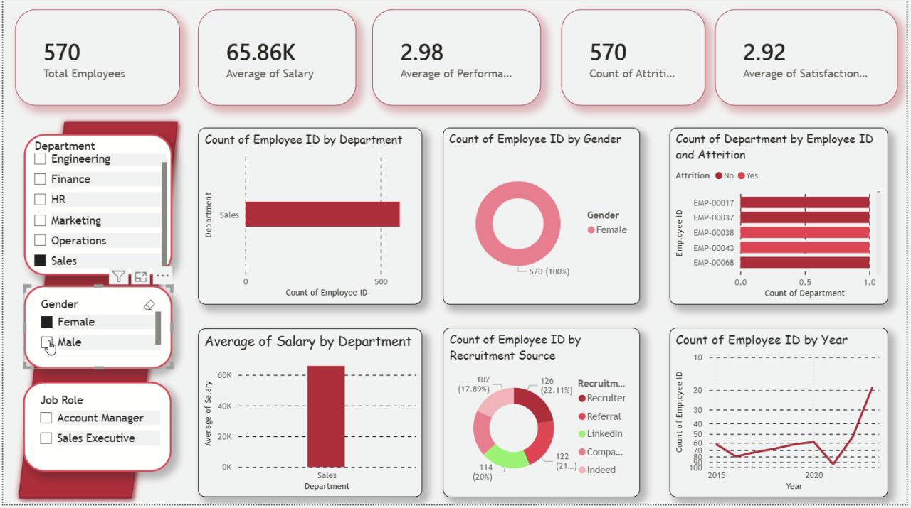

# HR Analytics Dashboard



Power BI dashboard for workforce metrics: headcount, compensation, performance, attrition, satisfaction, and recruitment.

## Overview

| Item | Detail |
|------|--------|
| **Dashboard** | HR Analytics |
| **Task** | CodeAlpha Task 2 |
| **Screen recording** | [`../CodeAlphaTask-2.mp4`](../CodeAlphaTask-2.mp4) (~30 s) |
| **Thumbnail** | [`thumbnail.png`](./thumbnail.png) |

## Key metrics (KPI cards)

| Metric | Sample value |
|--------|----------------|
| Total Employees | 570 |
| Average of Salary | 65.86K |
| Average of Performance | 2.98 |
| Count of Attrition | 570 |
| Average of Satisfaction | 2.92 |

## Filters (left sidebar)

- **Department** — Engineering, Finance, HR, Marketing, Operations, Sales
- **Gender** — Female, Male
- **Job Role** — e.g. Account Manager, Sales Executive

## Visualizations

| Chart | Purpose |
|-------|---------|
| Count of Employee ID by Department | Horizontal bar chart of headcount |
| Count of Employee ID by Gender | Donut chart of gender split |
| Count of Department by Employee ID and Attrition | Stacked bar by employee and attrition status |
| Average of Salary by Department | Column chart of average salary |
| Count of Employee ID by Recruitment Source | Donut chart (Recruiter, Referral, Indeed, LinkedIn, Company Website, etc.) |
| Count of Employee ID by Year | Line chart of hiring trends (2015–2023+) |

## Design notes

- Red and pink accent palette on white/grey cards
- Rounded visual containers with light shadows
- Interactive slicers drive all visuals

## Files in this folder

```
CodeAlphaTask-2/
├── README.md
└── thumbnail.png
```
