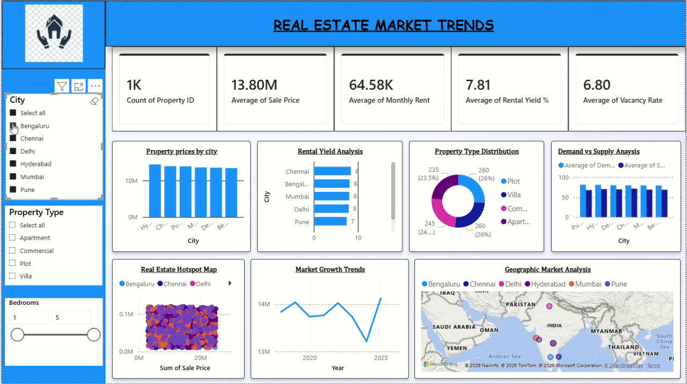

# Real Estate Market Trends Dashboard



Power BI dashboard for Indian real estate: pricing, rent, yield, vacancy, supply/demand, and geographic hotspots.

## Overview

| Item | Detail |
|------|--------|
| **Dashboard** | Real Estate Market Trends |
| **Task** | CodeAlpha Task 3 |
| **Screen recording** | [`../CodeAlphaTask-3.mp4`](../CodeAlphaTask-3.mp4) (~32 s) |
| **Thumbnail** | [`thumbnail.png`](./thumbnail.png) |

## Key metrics (KPI cards)

| Metric | Sample value |
|--------|----------------|
| Count of Property ID | 1K |
| Average of Sale Price | 13.80M |
| Average of Monthly Rent | 64.58K |
| Average of Rental Yield % | 7.81 |
| Average of Vacancy Rate | 6.80 |

## Filters (left sidebar)

- **City** — Bengaluru, Chennai, Delhi, Hyderabad, Mumbai, Pune
- **Property Type** — Apartment, Commercial, Plot, Villa
- **Bedrooms** — Range slider (e.g. 1–5)

## Visualizations

| Chart | Purpose |
|-------|---------|
| Property prices by city | Vertical bar chart of prices by city |
| Rental Yield Analysis | Horizontal bar chart of yield % by city |
| Property Type Distribution | Donut chart (Plot, Villa, Commercial, Apartment) |
| Demand vs Supply Analysis | Grouped bars comparing demand and supply |
| Real Estate Hotspot Map | Scatter plot of sale price by location |
| Market Growth Trends | Line chart from 2020 toward 2025 |
| Geographic Market Analysis | Map of India with city markers |

## Design notes

- Blue and white professional theme
- Header title: **REAL ESTATE MARKET TRENDS**
- Map and scatter views support location-based decisions

## Files in this folder

```
CodeAlphaTask-3/
├── README.md
└── thumbnail.png
```
